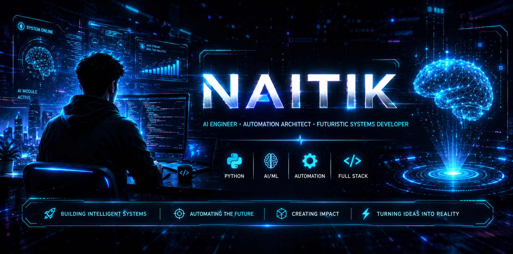

  

  

  

---

<h1 align="center">⚡ About Me</h1>

AI Engineer focused on building futuristic systems, intelligent automation, voice AI, and modern full stack applications.

Passionate about creating AI-powered experiences and next-generation technology ecosystems.

---

<h1 align="center">⚡ Tech Ecosystem</h1>

---

<h1 align="center">💻 Development Focus</h1>

| AI Engineering | Automation | Full Stack |
|---|---|---|
| Voice AI Systems | Workflow Automation | Modern Web Apps |
| LLM Integrations | Smart Assistants | Backend Architecture |
| AI Workflows | Productivity Systems | API Development |

---

<h1 align="center">📊 GitHub Analytics</h1>

---

<h1 align="center">🔥 GitHub Streak</h1>

---

<h1 align="center">📈 Contribution Graph</h1>

---

<h1 align="center">🌐 Connect</h1>

---

### ⚡ Building The Future With AI

